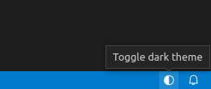

# VS Code Toggle Theme Extension

This extension adds a status bar item to quickly toggle between light and dark themes.

Clicking on the `🌓︎` icon in the status bar triggers the command `workbench.action.toggleLightDarkThemes`.
