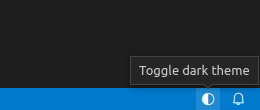

# VS Code Toggle Theme Extension

This extension adds a status bar item to quickly toggle between light and dark themes.

## How it works

Clicking on the `🌓︎` icon in the status bar triggers the command `workbench.action.toggleLightDarkThemes`
that was added in VS Code [1.69](https://code.visualstudio.com/updates/v1_69#_toggle-between-light-and-dark-themes).

## Attribution

The extension icon is based on the `color-mode` icon from the
[vscode-codicons](https://microsoft.github.io/vscode-codicons/) icon set
licensed under [CC BY 4.0](https://creativecommons.org/licenses/by/4.0/).
